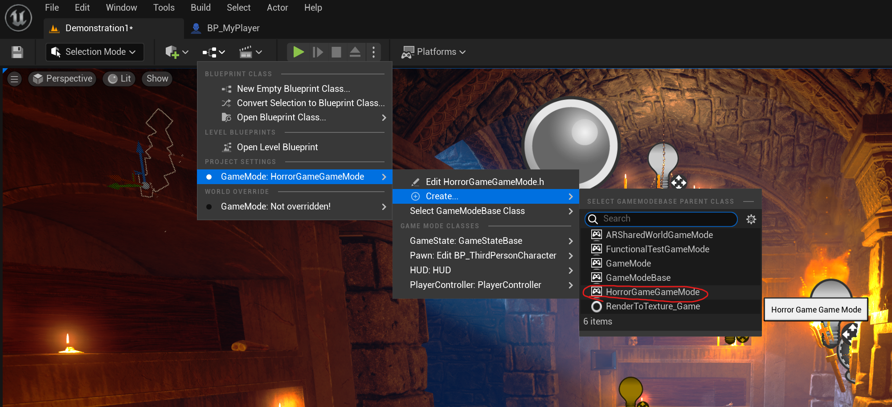

# UE5_Development_Procedure

## 目录

- [项目创建](#项目创建)
- [绘制地图](#绘制地图)

## 项目创建：

1. 创建项目：打开UE，选择GAME，根据需求选择第一人称，第三人称等，选择C++，选中starter content，最后点击create创建默认项目

2. 导入材料包：此时UE会为用户创建默认地图，我们先为项目导入材料包，稍后再更改地图。首先进入UE Launcher的MARKETPLACE并选择你喜欢的材料包下载。下载成功后进入Library并找到刚刚下载好的材料包。点击Add To Project选项将此材料包导入我们刚刚创建的项目，就此你就可以在UE编辑器的content文件夹中看见刚刚导入的材料包了， 如下图所示。

3. 更改编辑器为vscode: 在上方editor中找到editor preference并点击，根据下图所示更改编辑器。请注意使用vscode前请安装插件如C/C++，Unreal Engine 4 Snippets等。同时使用visual studio installer安装必须的依赖如.NET。

4. Build项目：如下图所示。

## 绘制地图

1. 创建空白地图并设置为默认地图：选择new level创建一个空白地图。

在content文件夹中创建一个新的文件夹用于存放我们刚刚创建的空白地图。创建完毕后点击保存，这里我们为地图命名并将其保存到我们刚刚创建的地图文件夹当中。

点击project settings并将默认地图设置为我们刚刚创建的空白地图，这样我们就可以在这个空白地图上进行创作了。

2. 利用材料包绘制地图：
 
 - 可以在左上角将lit改为unlit来获得不受光线干扰的结构。
 
 - 如图取消选中game settings可以得到一致的曝光，这样可以避免亮度会模拟人眼的效果。
 
 
 
3. 放置游戏开始位置和主角：

- 如果将character放置到地图中后点击play人物从地面自由落体，说明地面没有设置碰撞，我们需要按照下图双击SM_Floor并开启碰撞。

 

4. 创建GameMode：

